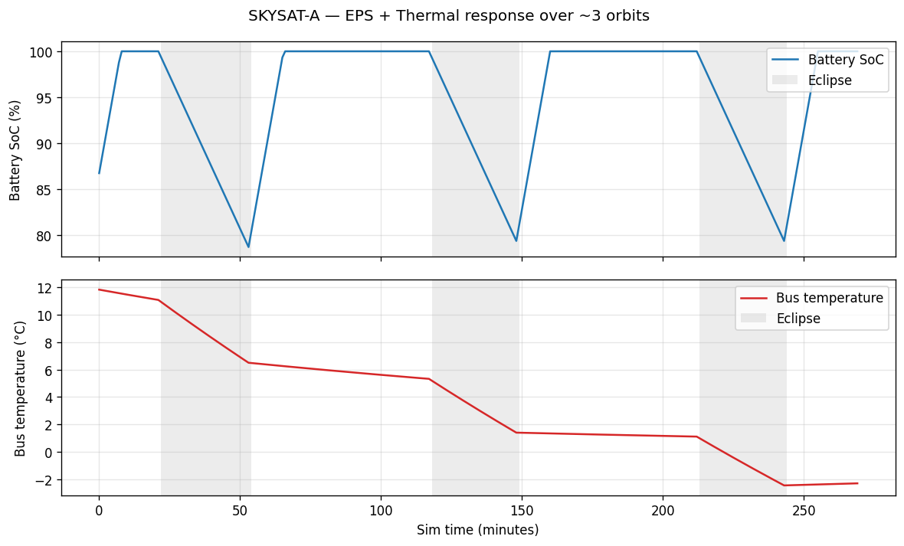
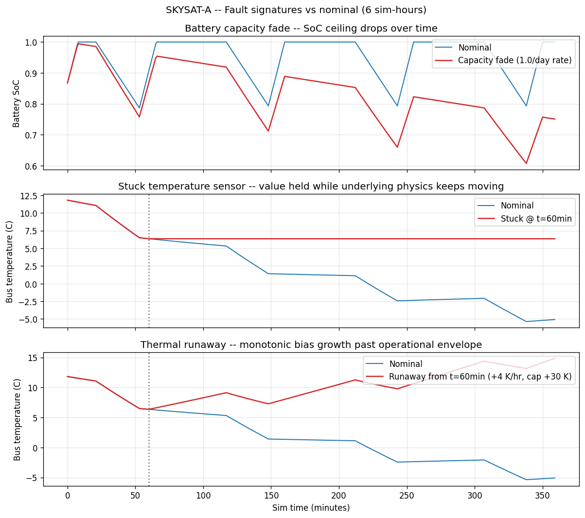
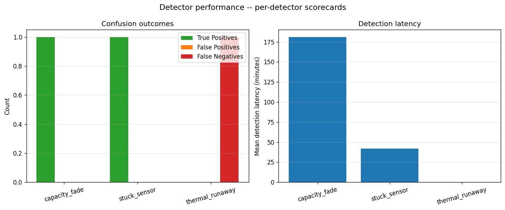

# orbit-ops

A simulated satellite constellation and the data platform that operates it.

10–20 virtual satellites generate physically realistic telemetry — power, thermal, attitude, comms — based on real orbits propagated from public TLE data. That telemetry streams through a production-shaped pipeline (Redpanda → Parquet on object storage → dbt transformations → DuckDB queries → Grafana dashboards). Per-subsystem anomaly detection catches deliberately injected faults: battery degradation, stuck sensors, thermal runaway, attitude excursions.

## Status

Feature-complete through Sprint 2. See [docs/PLAN.md](docs/PLAN.md) for the
full build plan and [docs/PROMPT_LEDGER.md](docs/PROMPT_LEDGER.md) for the
build log.

## Quick start

```bash
make demo-full   # full demo: stack + sim + consume + transform + detect
open http://localhost:3000   # Grafana dashboards
make stop        # tear down
```

Or step-by-step:

```bash
make demo    # bring up the full stack
make sim     # run the simulator
make stop    # tear down
```

Requires Docker, Docker Compose, and `uv`.

## Architecture

```
TLEs (Celestrak) ──► Sim (Skyfield + subsystem models)
                        │
                        ▼ (per-tick telemetry, keyed by sat_id)
                     Redpanda
                        │
                        ▼ (batched, partitioned writes)
                     Parquet on MinIO/R2
                     sat_id=X/date=Y/hour=Z/
                        │
                        ▼ (scheduled runs)
                     dbt-duckdb (raw → staging → marts)
                        │
                        ├──► Detectors (per-subsystem) ──► anomaly_events
                        │
                        ▼
                     Grafana (fleet → sat → subsystem drilldown)
```

## Telemetry sample

One SkySat propagated over ~3 orbits. Battery state-of-charge and bus
temperature respond to eclipse passages (shaded). The coupling is
emergent — nothing in the EPS or thermal code explicitly says "go down
in eclipse"; that pattern falls out of the physics.



## Fault injection

To validate the anomaly detection layer, the simulator can inject realistic faults
on configured satellites. Faults are layered on top of nominal physics — the
underlying model stays correct; the observed telemetry is what diverges, matching
how real anomalies present (the sensor lies, the cell degrades, the truth state
is what it is).

Three fault types are currently supported, each chosen to exercise a different
class of detection method:

| Fault | Symptom | Natural detection method |
|---|---|---|
| Battery capacity fade | Reported SoC ceiling drops over many sim-days | Change-point (CUSUM, Page-Hinkley) |
| Stuck temperature sensor | Temperature reading held while underlying physics moves | Cross-channel residual |
| Thermal runaway | Monotonic bias growth past operational envelope | Threshold |

Fault configuration is declarative — see `data/faults.example.yaml` for the schema.
Activate by copying to `data/faults.yaml` and re-running the simulator.



## Anomaly detection

Each fault class is matched with a detection method appropriate to its
signal shape. The matrix below summarizes the choice rationale; the
figure shows current performance against the example fault configuration.

| Detector | Method | Why this method |
|---|---|---|
| Capacity fade | CUSUM on rolling max-SoC | Slow drift in a noisy signal; designed for sustained-shift detection |
| Stuck sensor | Cross-channel residual vs heat-balance model | The value is plausible; the *correlation* is broken |
| Thermal runaway | Threshold + slope check | Operational limits are known; ML is not the answer to every problem |



The evaluator joins detector outputs against the fault YAML (ground truth)
to compute per-detector confusion outcomes and detection latency.

## Dashboards

Three Grafana dashboards, JSON-provisioned and version-controlled in
`dashboards/grafana/`. Auto-loaded on container start.

| Dashboard | Purpose |
|---|---|
| Fleet view | "Is anything wrong right now" -- table of all sats with health-band coloring |
| Satellite drilldown | Pick one sat, see all its telemetry + recent events |
| Anomaly feed | Chronological log of detector firings across the fleet |

Grafana queries the marts Parquet files directly via the DuckDB datasource
plugin -- no separate query service. Honors the project's "everything
queryable from object storage" architectural constraint.

To see the dashboards with real data:

```bash
make demo-full
open http://localhost:3000
```

`make demo-full` brings up the stack, runs a 24-hour sim with the example
faults active, consumes, transforms, and runs detection. After it completes,
all three dashboards have populated panels.

## Design decisions

Each choice below is one that has a real alternative worth weighing. The
rationale is given in the voice of "what I'd say if asked."

### Why DuckDB, not ClickHouse

At ~15 sats x 1 Hz x weeks of data we have tens of millions of rows, not
billions. ClickHouse is the right tool when you need clustered, multi-node
analytic storage; DuckDB is the right tool when a single process can hold
the working set and read columnar files directly. The architecture isn't
locked to DuckDB -- marts live as Parquet on object storage, so swapping
in ClickHouse, DataFusion, or Athena would be a query-layer change, not a
re-platform. DuckDB also keeps the "runs on an interviewer's laptop"
promise honest; ClickHouse would require a service to be running.

### Why dbt against Parquet, not streaming SQL

dbt is batch-oriented by design. Trying to make it streaming-aware
fights the tool. Instead, we treat Parquet on object storage as the
stream/batch boundary: the consumer batches messages into Parquet files
at the (sat_id, sim-hour) grain, and dbt runs on a schedule against those
files. This is the pattern most data teams actually ship with, because it
keeps the streaming infrastructure simple (just durable transport) and
the analytical infrastructure simple (just SQL on files).

### Why a sim-clock abstraction

Every component reads sim-time from a shared `SimClock` instance. Wall
clock is forbidden downstream. This lets the same producer code drive a
fast batch run (a week of telemetry in five minutes of wall time) or a
real-time stream (1 sim-second per 1 wall-second for the demo) without
code changes elsewhere. The deadline-based scheduling in REALTIME mode
ensures that work done between ticks (physics, Kafka publish) eats into
the sleep budget rather than accumulating drift -- same pattern as game
loops and trading simulators.

### Why fault injection is a layer, not part of physics

Faults transform the *observed* telemetry after subsystem step functions
have computed nominal state. The underlying physics stays clean. This
matches how real anomalies present: the sensor lies, the cells degrade,
but the satellite's truth state is whatever it is. Keeping faults as a
layer also means physics tests stay tight (they don't have to know about
faults) and fault tests stay tight (they don't have to know about
physics). The fault YAML doubles as ground-truth labels for detector
evaluation.

### Why one detection method per fault

Pragmatic anomaly detection picks the right tool per signal shape. Each
fault here exercises a different class of detection method on purpose:

- **Battery capacity fade -> CUSUM** on rolling max-SoC. Capacity fade is
  slow drift in a noisy signal; CUSUM (1950s control theory) was
  designed for exactly this. Cheap to compute, no training, defensible.

- **Stuck temperature sensor -> cross-channel residual**. A stuck sensor's
  reading is plausible in isolation; what breaks is its correlation with
  the heat-balance equation. We compute the predicted dT from the
  other thermal channels and watch the residual.

- **Thermal runaway -> threshold + slope**. The operational limit is
  known; the satellite shouldn't exceed 35 C. A threshold catches this
  directly. The slope check suppresses false positives from sunlit
  warming briefly grazing the ceiling. This is the case where ML would
  be silly -- and that's the design defense.

A generic "throw an isolation forest at the telemetry" approach would
catch some of these and miss others, with no way to explain the misses.
Three purposeful methods with clear failure modes are easier to operate
in production than one opaque model.

### Why partition Parquet by (sat_id, date, hour)

Hive-style partitioning encodes filter logic into the directory
tree itself. DuckDB, Spark, ClickHouse, and Athena all prune partitions
from path metadata before reading any file content. The two-level
time partition (date and hour) handles both daily queries ("yesterday's
data") and intra-day queries ("the past hour"). Going to per-minute
partitions would explode the file count without filtering benefit;
omitting hour would make any sub-day query scan a whole day's worth
of files per sat. Three levels is the sweet spot for this scale.

### Why a "marts as Parquet" architecture, not a single DuckDB file

dbt-duckdb's external materialization writes mart tables back to Parquet
on object storage. The reason: marts are read by multiple consumers
(Grafana, the detector runner, possibly future custom frontends). If the
marts lived inside a single `.duckdb` file, every consumer would need to
mount that file and only one could write at a time. With Parquet marts on
S3, every consumer queries the same files independently, and the storage
layer is the contract.

### Where the thermal model required iteration

The thermal model went through three rounds of parameter refinement,
each driven by an invariant test failure:

1. The initial array efficiency (0.28, cell-level) was too high for
   orbit-averaged power. Corrected to 0.15 (end-to-end system
   efficiency) -- different things.
2. The first model omitted Earth IR (~100 W continuous in LEO), which
   is the dominant reason eclipse temperatures don't crash toward
   deep-space values. Added as a named parameter with citation.
3. The radiating area assumed the satellite radiates from its full
   geometric surface; real smallsats wrap most surfaces in MLI
   blankets that suppress radiation. Corrected to ~1.2 m^2 effective
   radiator area.

Each correction is documented in the prompt ledger. The pattern: I sized
parameters from first-principles physics and missed the second-order
engineering corrections that turn ideal numbers into operational ones.
The invariant tests caught all three.

### Why no orchestrator (Airflow / Prefect)

For a portfolio project, `make transform` and `make detect` are honest.
Production would absolutely use an orchestrator -- scheduled dbt runs,
scheduled detector runs, alert routing, lineage tracking. The
architecture supports this trivially (every step is a CLI command);
adding Airflow would be scope creep that doesn't sharpen the signal of
the data engineering work.

### Why a 24-hour demo window

The example fault scenarios use realistic accelerated-failure parameter
scales (e.g., 0.15/day battery capacity fade -- aggressive but not
cartoonish). At those scales, the detection methods require at least
12-24 hours of observation to fire confidently. The demo runs 24 hours
of sim time in roughly 60 seconds of wall time (FAST mode), exercising
the detectors at their operationally-tuned thresholds rather than at
artificially weakened ones. This is the same trade-off real ops teams
face: detection latency is bounded by signal-to-noise in the data, and
you can't make a slow-drift detector fast by lowering its threshold
without taking the false-positive rate with you.

## Project context

Portfolio project targeting a data software role at a smallsat operator. The brief: demonstrate space-domain literacy, real data engineering practice, pragmatic anomaly detection, and the ability to ship something that runs on an interviewer's laptop.

## License

MIT
